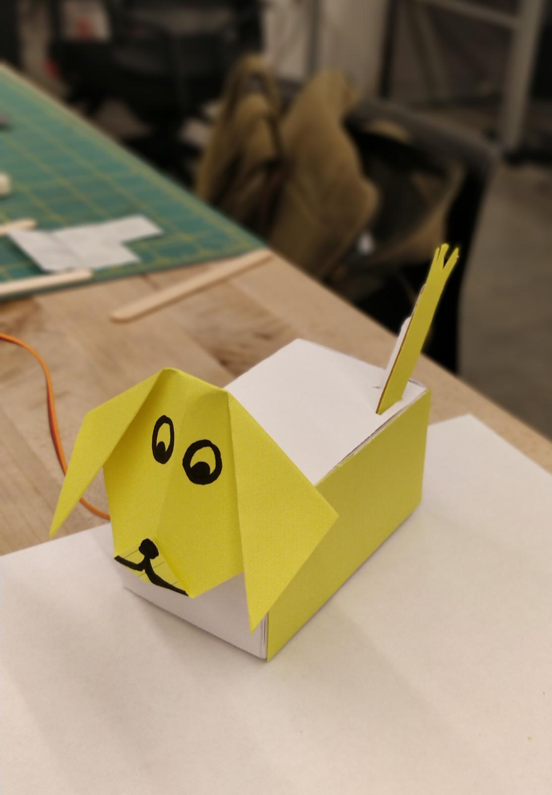

# Paper Puppets

*Lab report 4 by Ananya Paul Student*

## In this Report

To submit your lab, clone [this repository](https://github.com/FAR-Lab/IDD-Fa18-Lab4). You'll need to describe your design, include a video of your paper display in operation, and upload any code you wrote to make it move.

## Part A. Actuating DC motors

**Link to a video of your virbation motor**

[Vibration Motor](https://youtu.be/5hCh_DmNyKA)

## Part B. Actuating Servo motors

### Part 1. Connect the Servo to your breadboard

**a. Which color wires correspond to power, ground and signal?**

Red : +ve
<br/>
Brown : -ve
<br/>
Orange : Signal

### Part 2. Connect the Servo to your Arduino

**a. Which Arduino pin should the signal line of the servo be attached to?**

Pin 9

**b. What aspects of the Servo code control angle or speed?**

The delay controls the speed. Higher the delay, slower the movement and vice versa. 
The angle is controlled by the pos value in the for loop. Higher the value, bigger the angle and vice versa.

```
#include <Servo.h>

Servo myservo;  // create servo object to control a servo
// twelve servo objects can be created on most boards

int pos = 0;    // variable to store the servo position

void setup() {
  myservo.attach(9);  // attaches the servo on pin 9 to the servo object
}

void loop() {
  for (pos = 0; pos <= 90; pos += 1) { // controls the angle
    // in steps of 1 degree
    myservo.write(pos);             
    delay(150);                       // controls speed
  }
  for (pos = 90; pos >= 0; pos -= 1) { // controls the angle
    myservo.write(pos);              
    delay(150);                       // controls speed
  }
}

```

## Part C. Integrating input and output

**Include a photo/movie of your raw circuit in action.**

[Pre-Programmed Servo Motor movement](https://youtu.be/-2SqL0_NraI)

## Part D. Paper puppet

**a. Make a video of your proto puppet.**

[Puppet](https://youtu.be/EooTCklrrcs)

## Part E. Make it your own

**a. Make a video of your final design.**

[Good boy wagging his tail](https://youtu.be/5jhqTsDqOSM)

 
